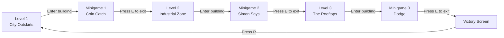

# Neon Runner — Architecture Walkthrough

## Project Structure

```
armin/
├── main.lua                 # Entry point & state machine
├── utils.lua                # Shared helpers (AABB collision)
├── player.lua               # Player entity (physics, drawing)
├── camera.lua               # Smooth horizontal camera
├── states/
│   ├── play.lua             # Platforming gameplay state
│   ├── building.lua         # Building interior / minigame wrapper
│   └── victory.lua          # End-game screen with confetti
├── levels/
│   ├── level1.lua           # "City Outskirts" (easy)
│   ├── level2.lua           # "Industrial Zone" (medium)
│   └── level3.lua           # "The Rooftops" (hard)
└── minigames/
    ├── coin_catch.lua       # Catch falling coins, avoid bombs
    ├── simon.lua            # Repeat arrow-key sequences
    └── dodge.lua            # Survive falling hazards for 20s
```

## Game Flow



## State Machine

[main.lua](file:///home/cschmidt/git/cslove/armin/main.lua) implements a lightweight state manager. Each state is a Lua table with these optional methods:

| Method | Called when |
|--------|-----------|
| `enter(...)` | Switching **to** this state (receives level number, etc.) |
| `exit()` | Switching **away** from this state |
| `update(dt, game)` | Every frame |
| `draw(game)` | Every frame |
| `keypressed(key, game)` | Key pressed |
| `keyreleased(key, game)` | Key released |
| `mousepressed(x,y,btn,game)` | Mouse clicked |

The `game` table passed to every callback contains:
- `game.currentLevel` — current level number (1–3)
- `game.maxLevels` — total levels (3)
- `game.switchState(name, ...)` — transition to another state

## How Levels Work

Each [level file](file:///home/cschmidt/git/cslove/armin/levels/level1.lua) returns a plain data table:

```lua
return {
    name = "City Outskirts",
    playerStart = { x = 100, y = 400 },
    building = { x = 2400, y = 350, width = 120, height = 150 },
    boxes = { ... },    -- platforms (type = "solid" | "bouncy")
    enemies = { ... },  -- patrol enemies
}
```

> [!TIP]
> To add a new level, just create `levels/level4.lua` with the same format, increment `maxLevels` in main.lua, and add a 4th minigame module.

## How Minigames Work

Each minigame module implements the same interface:

| Method | Purpose |
|--------|---------|
| `init()` | Reset all state for a fresh play |
| `update(dt)` | Game logic each frame |
| `keypressed(key)` | Handle input |
| `isCompleted()` | Return `true` when the player has won |
| `draw()` | Render within the building interior |

The [building state](file:///home/cschmidt/git/cslove/armin/states/building.lua) draws the interior walls/floor, then delegates to the active minigame for content.

### The 3 Minigames

| # | Name | File | Goal |
|---|------|------|------|
| 1 | **Coin Catch** | [coin_catch.lua](file:///home/cschmidt/git/cslove/armin/minigames/coin_catch.lua) | Catch 15 coins with A/D. Bombs cost −3 pts. |
| 2 | **Simon Says** | [simon.lua](file:///home/cschmidt/git/cslove/armin/minigames/simon.lua) | Repeat 3 rounds of growing arrow sequences (WASD/arrows). |
| 3 | **Dodge** | [dodge.lua](file:///home/cschmidt/git/cslove/armin/minigames/dodge.lua) | Survive 20 seconds of falling hazards. Hits cost −3 seconds. |

## Controls

| Key | Action |
|-----|--------|
| **A / D** or **← / →** | Move left / right |
| **Shift** or **Z** | Sprint |
| **Space / W / ↑** | Jump (hold for higher, release for short hop) |
| **E** | Enter / exit building |
| **R** | Restart (on death or victory screen) |

## Adding Content

> [!IMPORTANT]
> When adding new levels or minigames, follow these steps:

1. **New level**: Create `levels/levelN.lua`, add a corresponding entry in `minigameModules` and `minigameNames` in [building.lua](file:///home/cschmidt/git/cslove/armin/states/building.lua), and bump `maxLevels` in [main.lua](file:///home/cschmidt/git/cslove/armin/main.lua).
2. **New minigame**: Create `minigames/your_game.lua` implementing `init/update/keypressed/isCompleted/draw`, then register it in building.lua's module/name arrays.
3. **New box type**: Add the type string to your level data and handle it in both [player.lua](file:///home/cschmidt/git/cslove/armin/player.lua) (collision) and [play.lua](file:///home/cschmidt/git/cslove/armin/states/play.lua) (drawing).
